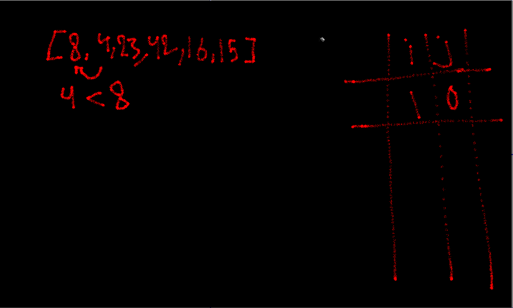

# Insertion Sort
Insertion sort is a simple sorting algorithm that works similar to the way you sort playing cards in your hands. The array is virtually split into a sorted and an unsorted part. Values from the unsorted part are picked and placed at the correct position in the sorted part.
## Pseudocode:

## Trace
Sample Array: [8,4,23,42,16,15]

loop on the array starting from index number 1:

Step 1 :

- key equals the second element of the array which is 4 
- we compare all the previous elements with the temp 
- 8 is bigger than 4 thus we shift

Step 2:

- 23 is greater than 8 
- we are not required to shift nor compare with the other elements

Step 3:

- 42 is greater than 23
- we are not required to shift nor compare with the other elements

Step 4: 

- 42 is greater than the key thus we shift 42 one position into the right
- 23 is greater than the key thus we shift 23 one position into the right
- key is greater than 8 thus we stop comparing and place our key 

Step 5:

- 42 is greater than the key thus we shift 42 one position into the right
- 23 is greater than the key thus we shift 23 one position into the right
- 16 is greater than the key thus we shift 23 one position into the right
- key is greater than 8 thus we stop comparing and place our key

## Efficency
- Time: O(n^2)
- Space: O(1)