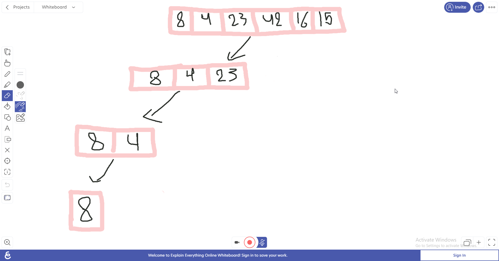
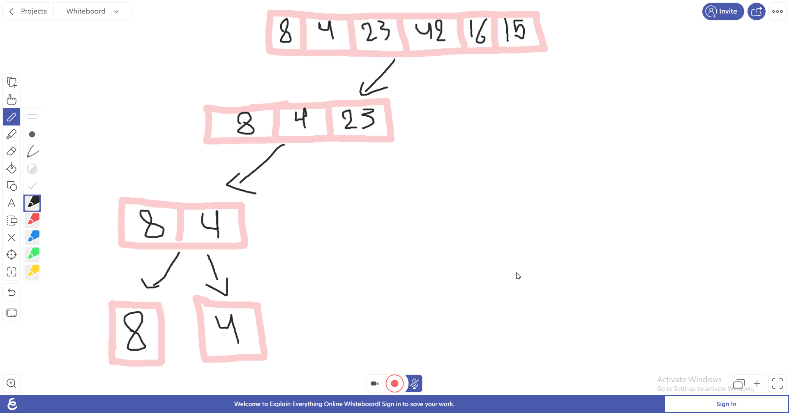
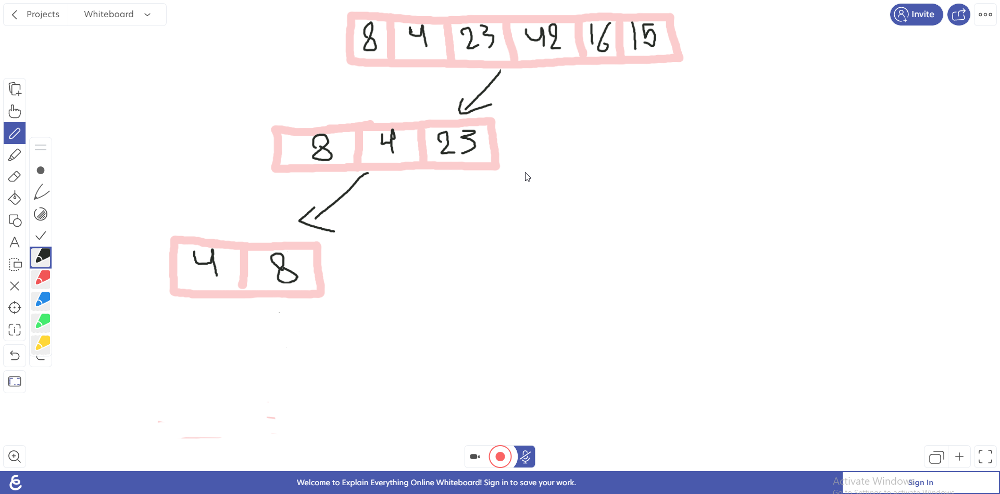
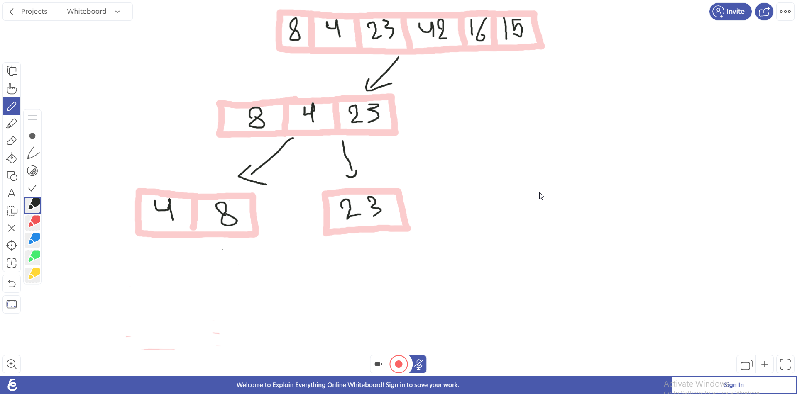
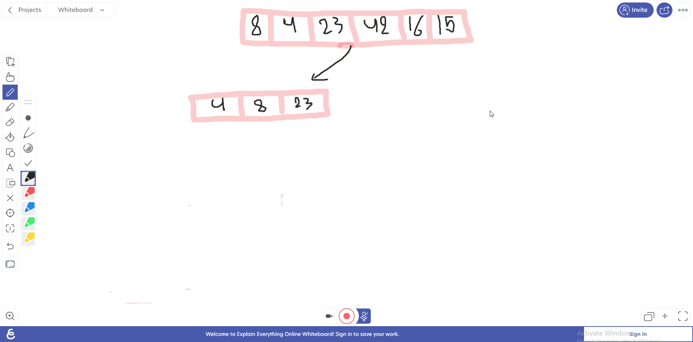
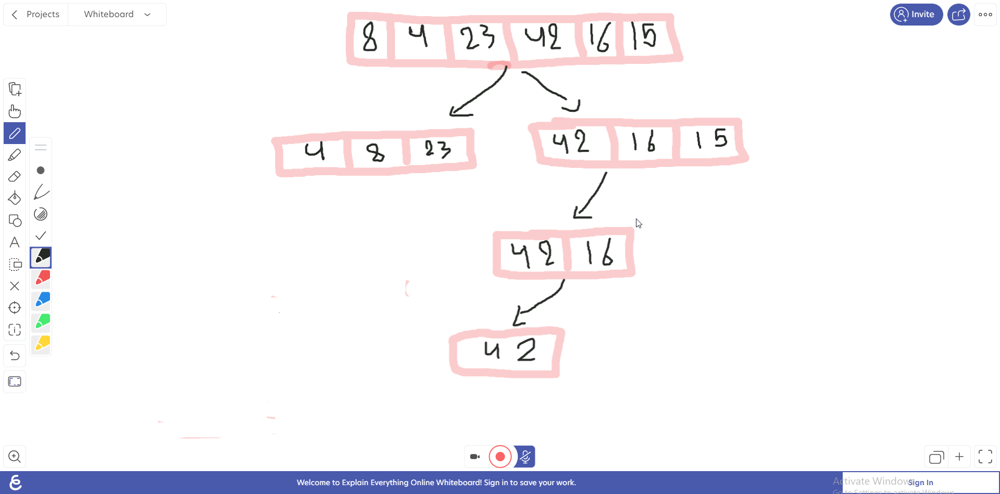
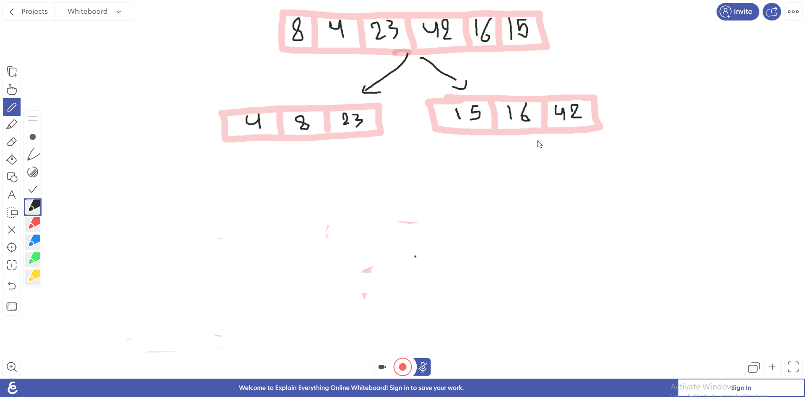
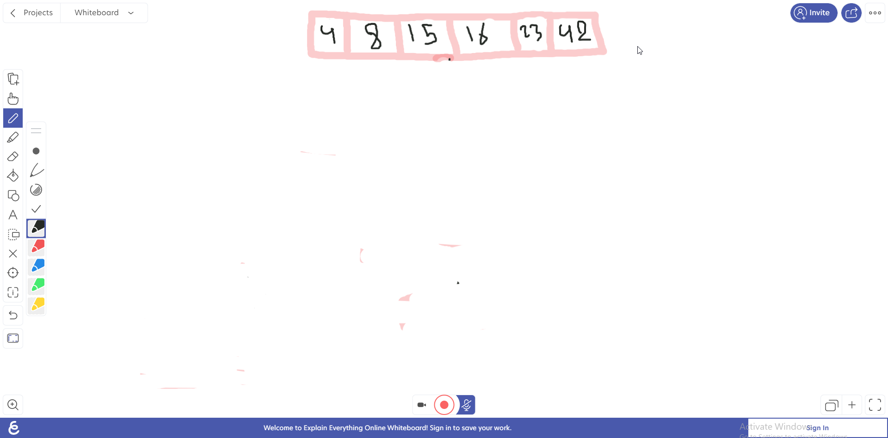

# Merge Sort
Merge Sort is a Divide and Conquer algorithm. It divides the input array into two halves, calls itself for the two halves, and then merges the two sorted halves.

## Pseudo Code
ALGORITHM Mergesort(arr)
    DECLARE n <-- arr.length

    if n > 1
      DECLARE mid <-- n/2
      DECLARE left <-- arr[0...mid]
      DECLARE right <-- arr[mid...n]
      // sort the left side
      Mergesort(left)
      // sort the right side
      Mergesort(right)
      // merge the sorted left and right sides together
      Merge(left, right, arr)

ALGORITHM Merge(left, right, arr)
    DECLARE i <-- 0
    DECLARE j <-- 0
    DECLARE k <-- 0

    while i < left.length && j < right.length
        if left[i] <= right[j]
            arr[k] <-- left[i]
            i <-- i + 1
        else
            arr[k] <-- right[j]
            j <-- j + 1

        k <-- k + 1

    if i = left.length
       set remaining entries in arr to remaining values in right
    else
       set remaining entries in arr to remaining values in left

## Trace

### Step1
**we recursivly split the array starting with the left until the size of the array is not greater than 1**

### Step2
**once its done it will recursivly start splitting the right side of the array**

### Step3
**then it will merge accordinly from small to big**

### Step4
**then it will again go back to the right recursive function and split the right**

### Step5
**then it will merge again !**

### Step6
**then again back with the recursive function of the right**

### Step7
**By following the previous steps we will end up having**

### Final Step
**Our final product should look like this!**

## Efficency
- Time: n*log(n)
- Space: n